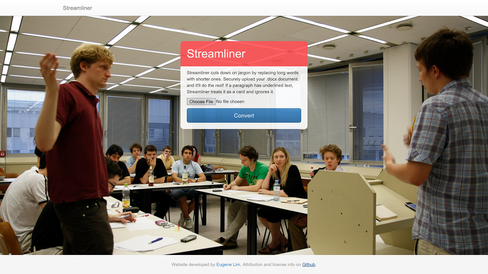

# Streamliner

Flask webapp that replaces words in uploaded docx files and outputs the new version. Useful if you want to quickly replace a dictionary of words. Streamliner was built for a debating website to reduce the number of syllables in a speech, but can be easily repurposed.

## Setup

### Dependencies

Streamliner was built on Python 2.7 and Flask. It uses the python-docx library, which can be easily installed with pip using `pip install python-docx`.

### Quickstart

1. Clone the project and enter the directory
2. Fill in replacement_dict in models.py using the format `KEY: (VALUE,SYLLABLE_DIFF)`
3. `export FLASK_APP=app.py`
4. `flask run`

## Notes
Replacing words in pure text is straightforward, but a couple of things added layers of complexity that made a straightforward `replace()` impossible:
1. As per debate tournament rules for evidence, words in evidence paragraphs (marked by underlines) cannot be replaced and must appear in their full form. One way to get around this is "lining down" words e.g. "United States" would have the "U" and "S" set at a normal font size while the rest of the letters have a smaller font. This requires detecting which words in the dictionary support lining down (their character-level replacements are *consecutive* but not necessarily *contiguous* substrings) and then formatting accordingly.
2. Word's .docx formats splits text into paragraphs and runs, complicating the process of adding additional formatting like highlights. This required creating a new set of runs per paragraph and some tricky slices. It also separates formatting from text, requiring additional checks.
3. You can also have replacement/key *phrases*, not just *words*, which requires carefully sequencing (OrderedDict) and updating the paragraph after each replacement. For example, some keys are substrings of other keys.
4. Some words can be replaced by empty strings, tripping up parses.
5. Microsoft Words abstracts style and formatting into several locations with certain rules of precendence, meaning any application of formatting must navigate these.
6. Preserving the previous formatting is essential for usability. However, the previous considerations meant that I had to scrap the runs that held those styles and had to "remember" the styles.

## Deploy
An integrated, customized version of Streamliner that includes database logging, JavaScript-based feedback (e.g. 'You saved X syllables!'), and more is available. Contact me at [my website](https://www.pinewebarchitects.com/) to request it.
